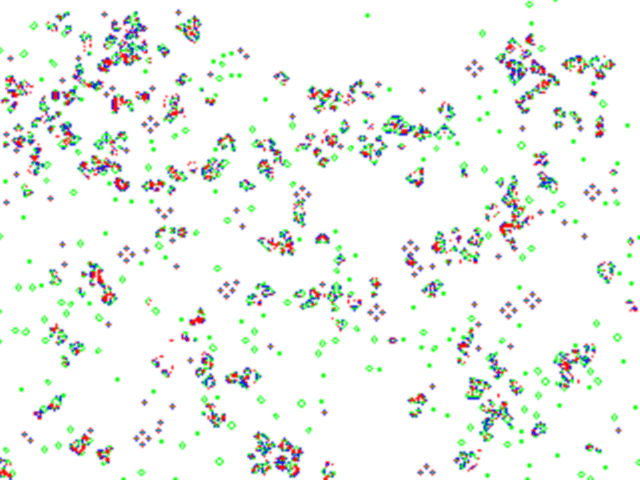

CellularAutomata: Game Of Life
===============================

> Explorations in Cellular Automata

<br /><p align="center"></p>

Dependencies:
---------------
+ [OpenCV](http://opencv.org/)
+ [g++](http://gcc.gnu.org/)

Compile and Run
---------------
1. Install the above dependencies
2. Clone the [Repository](https://github.com/debanjum/CellularAutomata.git) OR [Download](https://github.com/debanjum/CellularAutomata/archive/master.zip) and Unzip it
3. Compile and Run
```sh
$ cd /path/to/directory
$ g++ -ggdb `pkg-config --cflags opencv` -o `basename Game_Of_Life.cpp .cpp` Game_Of_Life.cpp `pkg-config --libs opencv`	# Compiles Script
$ ./Game_Of_Life	# Runs Script
```

The Conditions:
---------------
+ Alive: 3 Moore Neighbours OR 2 Moore Neighbours and Previously Alive
+ Dead:  If Not Alive

The Kernel:
---------------
+ 3*3 Matrix 
+ Centre Element = 0;
+ All the Rest   = 1; ( Kept 1/8 in program so as to keep convolution sum within matrix range(8*1/8=1) )
	
Program Description:
---------------
+ Captures Image From Camera To Obtain Randomised Initial Generation Condition
+ Convolution Done Using Standard Filtering Func in OpenCV ( Filter2D() )
+ Shows Program Evolution in Detail (Colour Image) :
	+ Dead			= White;
	+ Dying			= Red;
	+ Coming Alive	= Blue;
	+ Staying Alive	= Green;

Program Optimisation
---------------
+ Image Pyred Down for Evaluation (Displayed In Original Size)
+ Most Likely Condition Kept First ( >3 | <2 )
+ Camera Released After Initial Image Capture
+ 'if' Statements Used in Nested Format

Program Flexibilty
---------------
+ Convolution Kernel can be Modifed Easily (For Testing Different Kernels)
+ Game Rules Can be Modified Easily (For Testing Different Rules)
+ Colour Evolution gives more details about the Evolution Process
+ Evolution can be carried out on Original Image (For Testing Robustness & Dependence on I.C)

Performance Characteristics
---------------
+ Average Time For Evaluating Each Evolution ~ 75ms for Dell Studio_15, ~25ms for Dell Vostro_3560

To-Do
---------------
+ HSV Thresholded Image Based Initial Condition
+ Rabbits & Wolves Rules
+ Rabbits & Wolves Rules Based on HSV Thresholded Image[Say Blue Thresh For Rabbit, Red Thresh for Wolf]

Bugs
---------------
Please file bug reports at https://github.com/debanjum/CellularAutomata/issues

License
---------------
This program is free software; it is distributed under the Mozilla Public License v2.

[MPLv2](./LICENSE) © [CellularAutomata](./AUTHORS)
